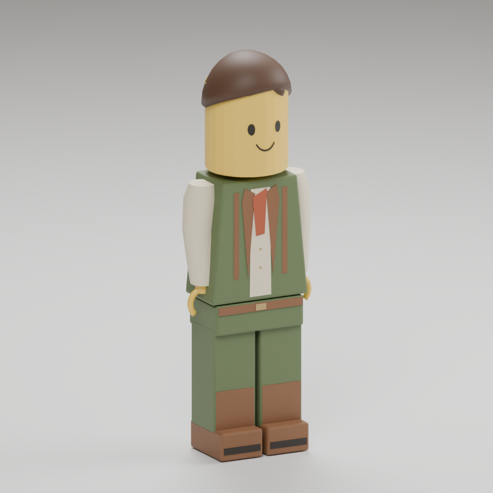

# Original warm brick adventurer

This package implements the owner's correction: **warm LEGO-style people, not robots or ordinary sculpted humans**. It is an original brick minifigure, with no logos or external character/texture inputs. The technical `human-r01` path and `robot_*` node names are compatibility identifiers; they do not describe the visible art.



The large yellow cylindrical head has a simple printed-style smile and eyes. Molded hair, a moss trapezoid torso, cream sleeves, a rust scarf print and brown boots give the figure a warm adventure role. Legs are short continuous toy blocks. Each sleeve is one molded shape. The C-shaped hands have real open centres and gaps. The former ordinary-human and long-leg candidates are not installed here.

## Runtime contract

- Asset identity `voxys-adventure-human-r01`, profile `salvage-animated-rigid-v1`, schema 1. Load `manifest.json` and its hash-bound `human.vmesh` through the explicitly allowed human/person identity. Preserve the separate legacy robot identity and files.
- Canonical metres: +Y up, −Z forward. Authoring basis is `(−X, Z, Y)`; exported glTF/VMESH uses the existing **render-to-canonical cube basis 12**. No alternative axis correction or per-character scale is needed.
- Root origin is the feet. Standing height is **1.70000005m** (float rounding), width **0.584m**. Existing player collision stays 1.7m high with 0.3m radius; no world, house, quest, tool or save changes are authored by this package.
- Same 22 nodes, 15 rigid meshes and six established `robot_*_anchor` names. The meshless `robot_root` is static. The animation ABI is retained, including internal knee/elbow nodes; the visible design does not expose segmented robotic joints.
- All eight exported clips are real Blender NLA actions: `idle` 2s, `walk` .8s, `jump` .5s, `fall` .6s, `swim` 1.2s, `helm` 2s, `tool` 1s and `land` .4s. There are 37 retained moving translation/quaternion channels. No animated scale, skeleton skinning, cloth simulation or horizontal root motion.
- Walk swings continuous toy legs at the hips with a sole-preserving pelvis lift. Knee and ankle nodes remain rigid. Landing is a brief torso/arm settle with planted block legs.
- Use neutral/white instance tint. Saturated whole-body robot tints would discolor the yellow head. Future resident variation should change appropriate clothing/hair material factors, keeping stable NPC IDs and accepted save state; this package is one original base figure, not three completed resident variants.

## Measured payload

| LOD | Vertices | Triangles | Expanded draws | VMESH bytes | GPU geometry bytes |
| --- | ---: | ---: | ---: | ---: | ---: |
| Near | 6,269 | 4,162 | 26 | 504,403 | 501,824 |
| Middle | 3,199 | 2,322 | 26 | 272,323 | 258,704 |
| Far | 1,521 | 1,194 | 25 | 144,723 | 124,352 |

GPU geometry counts include 72 bytes per vertex, four bytes per index and 64 bytes per material. They exclude instance buffers, renderer attachments and other game assets. The runtime currently loads the near mesh; existence of smaller LOD assets is not a claim that runtime LOD selection is enabled or performance measured.

Near VMESH SHA-256: `2d86136c1ce5842a6e0da3dd3e890ef151f48a943ef7aca7b414186f1a43b1e2`.

Manifest SHA-256: `d08532cb292d4e996165d29746198adebe3d03eec6b72be62f338024e39e0af1`.

## Verification and limits

All three sources passed closed-component/manifold, nondegenerate triangle, positive summed component volume, unit-normal, node/clip/scale and strict cooker checks. `geometry-check.json` contains observations of actual exported vertices and keys; hashes were compared with the installed sources. All eight clips are sampled, with 121 samples for walking and 17 for each other clip. This is a bounded sampled check, **not a continuous collision sweep**.

The standing torso/head/hips fit the existing upright capsule, including its hemispheres (crown tolerance 4.8e−8m). Near sampled walk width is .584804m; the lowest walking boot is +.000694m. The actual C-hand inner vertex radius is .046m; the lower opening remains empty. Landing and falling poses also keep sampled boot vertices at or above the local ground plane.

The walking pelvis lift makes the visual crown reach **1.726753m**, giving more than .51m of headroom in the installed 2.24m doorway. The 1.36m doorway also leaves more than .77m total width margin. These are visual-envelope measurements against existing dimensions; the animation does not change authority collision. Raised arms, swim and tool reach are also presentation envelopes, not extra colliders. Runtime traversal, camera, controller, actual rendered materials and owner feedback must still be checked in the integrated game.

`proof.png` is one final CPU studio proof from the installed editable near `.blend`, after the purposeful minifigure silhouette correction. `proof.json` records the exact source/image/recipe hashes. It is neither a game screenshot nor acceptance of final art quality.

## Reproduce

Run from the repository root with new output directories. The installed Blender executable is used directly; the snap launcher may be unavailable on hosts without its service.

```sh
/snap/blender/current/blender --background --factory-startup -noaudio --threads 2 --python-exit-code 1 --python tools/adventure_assets/author_human_adventurer.py -- --output-dir <new-authored-directory>
python3 tools/adventure_assets/check_human_adventurer.py <new-authored-directory>
python3 tools/adventure_assets/cook_human_adventurer.py --tool bazel-bin/tools/gltf_vmesh_tool --source-dir <new-authored-directory> --output-dir <new-package-directory>
/snap/blender/current/blender --background --factory-startup -noaudio --threads 2 --python-exit-code 1 --python tools/adventure_assets/author_human_proof.py -- --source <new-package-directory>/source/human-lod-0.blend --output <new-proof.png>
```

The cooker must support `salvage-animated-rigid-v1`; older retained CMake tools that only support `salvage-rigid-v1` correctly refuse this input. There is no permissive fallback. `provenance.json` includes editable parameters, the original material palette, all source/helper hashes, Blender version and three source GLB/Blend bindings. Materials use solid PBR factors and thin conforming color patches; no bitmap texture or generated concept pixels are part of the model.
