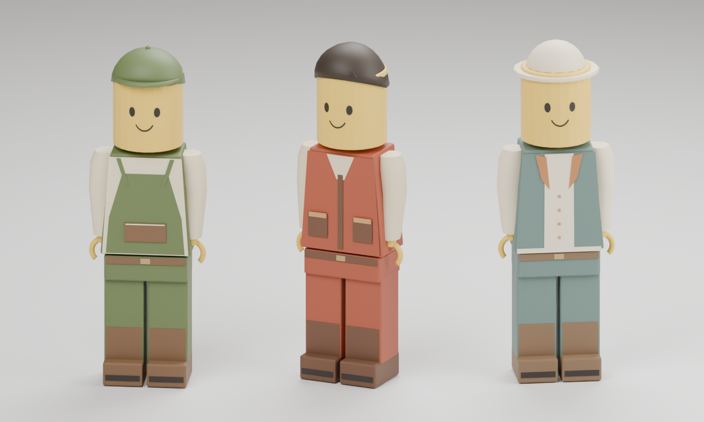

# Original warm brick residents

Three original LEGO-style toy people for the existing town. Stable IDs, quests, accepted positions and saves are owned by the game; this package changes character appearance only. The player package at `data/adventure/human-r01` is unchanged.



Left to right:

| Resident | ID | Readable role details | Explicit asset identity |
| --- | ---: | --- | --- |
| Moss, builder | 1 | Green work cap with bill; cream shirt, moss apron and broad apron pocket | `voxys-adventure-resident-moss-r01` |
| Rivet, outfitter | 2 | Dark swept molded hair; rust waistcoat, large pockets and a rolled travel blanket on the pack | `voxys-adventure-resident-rivet-r01` |
| Lumen, beacon keeper | 3 | Brimmed cream keeper hat; pale blue-moss coat, cream facing and small brass buttons | `voxys-adventure-resident-lumen-r01` |

These are geometry and material variants, not whole-body instance recolors. Yellow cylinder heads, simple printed-style eyes/smiles, C-shaped hands and continuous short block legs retain the frozen player's toy design. There are no robot visors, glowing joints, organic fingers, logos or external model/texture inputs. Packs and clothing pockets are character decoration, not usable world furniture.

## Loader contract

Each `moss/`, `rivet/` and `lumen/` directory contains `manifest.json`, `provenance.json`, `character.vmesh`, `lod1.vmesh`, `lod2.vmesh` and editable `source/character-lod-{0,1,2}.{blend,glb}`.

Use the corresponding explicit resident identity and `character.vmesh` filename. The profile remains `salvage-animated-rigid-v1`, schema 1, cube basis 12, maximum 32 nodes / 24 meshes / 48 draws. The separate robot/player whitelists must remain intact.

All variants have 22 nodes, 15 rigid meshes, 8 clips and 37 moving channels. Compatibility `robot_*` node/anchor labels remain unchanged. Clips are `idle`, `walk`, `jump`, `fall`, `swim`, `helm`, `tool`, `land`, with the same timing and rigid toy motion as the frozen player. This is not skinned animation or cloth simulation. Canonical units are metres, +Y up and −Z forward. The meshless root remains static; walking pelvis motion is a presentation pose.

Use white instance tint. Resident palettes are baked into material factors, preserving the yellow heads. Runtime must select the correct model for IDs 1/2/3; authoring JSON is provenance, not a dynamically interpreted gameplay registry.

## Measured near payload

| Resident | Vertices | Triangles | Draws | VMESH bytes | GPU geometry bytes |
| --- | ---: | ---: | ---: | ---: | ---: |
| Moss | 6,519 | 4,358 | 27 | 523,507 | 522,112 |
| Rivet | 8,201 | 5,098 | 26 | 649,195 | 652,160 |
| Lumen | 6,517 | 4,266 | 27 | 522,818 | 520,864 |

Combined near geometry is 1,695,136 GPU bytes and 80 expanded draws. This excludes instance buffers, the player, render targets and the rest of the scene. All three LODs are cooked and independently checked for each resident; their presence does not claim runtime LOD selection or measured game performance.

Near VMESH hashes:

- Moss: `cddf90a84bd77ab563ea3424f7cb69c6de329db4e127a9a6b8de059a87c81c9c`
- Rivet: `df7ed40c7874b8e60753079630dd659a4d2f200cdb49bb63419e9ec2a1cf9c4c`
- Lumen: `1a3c4dcde427a80290145bd639afe67bb7876b0f87f59aafdae1086fd198d4cf`

Manifest hashes:

- Moss: `ebac0383c140e4bdd7d879842cd15819ebfe4123ed47adc636eec01ef1555d97`
- Rivet: `70edf394b0bae7fa795472c47bc29fa39de97ac71aa5c23f0d1518697544feb1`
- Lumen: `b3c35b373f6b1a0b54257d0cabb321189595ec9d2f5346df7b8c2b9fc59d1a4c`

## Checks and limits

Nine actual GLB sources passed the established CPU vertex/clip sampler, closed-component/nondegenerate geometry checks, normal checks, static-root/unit-scale rules and strict animated-rigid cooker. The C-grip centres and lower gaps remain open. Authoring and final packaging compare every installed player-file hash against the frozen snapshot; none changed.

Standing height is 1.70000005 m and width .584 m. Standing torso/head/hip vertices fit the unchanged .3 m-radius, 1.7 m-high capsule, including its hemispheres. Walking width is .584804 m. The inherited hip-rock lift reaches 1.726753 m, with more than .51m doorway headroom and .77m total width margin in the existing 2.24 × 1.36 m doorway. Sampled walking/landing/falling boots stay on or above their local ground plane. Each walk uses 121 pose samples; other clips use 17. This is bounded sampled evidence, not a continuous sweep or a claim that every moving vertex fits the standing capsule.

`geometry-check.json` holds exact measurements and installed source-hash equality. `proof.png` is the single contact sheet from actual installed editable models, inspected after authoring; `proof.json` binds it to sources and recipe. The front sheet clearly shows headwear and clothing; the travel roll is authored on Rivet's back and is not claimed visible in that frontal view. Actual game rendering/interaction and owner art feedback remain separate acceptance work.

## Reproduce

From the repository root, use new directories:

```sh
/snap/blender/current/blender --background --factory-startup -noaudio --threads 2 --python-exit-code 1 --python tools/adventure_assets/author_resident_minifigures.py -- --output-dir <new-authored-directory>
python3 tools/adventure_assets/check_resident_minifigures.py <new-authored-directory>
python3 tools/adventure_assets/cook_resident_minifigures.py --tool bazel-bin/tools/gltf_vmesh_tool --source-dir <new-authored-directory> --output-dir <new-package-directory>
/snap/blender/current/blender --background --factory-startup -noaudio --threads 2 --python-exit-code 1 --python tools/adventure_assets/author_resident_proof.py -- --package <new-package-directory> --output <new-proof.png>
```

The new resident recipe imports the original frozen player recipe read-only, replaces headwear and adds original role clothing/pack geometry, then reuses its existing rigid clips. Each provenance file retains the base player snapshot, helper hashes, palette, author hash, Blender version and each exact source binding. The cooker accepts only the three explicit identities and publishes all three packages atomically; it never falls back to the unanimated glTF profile or overwrites an installed output.
