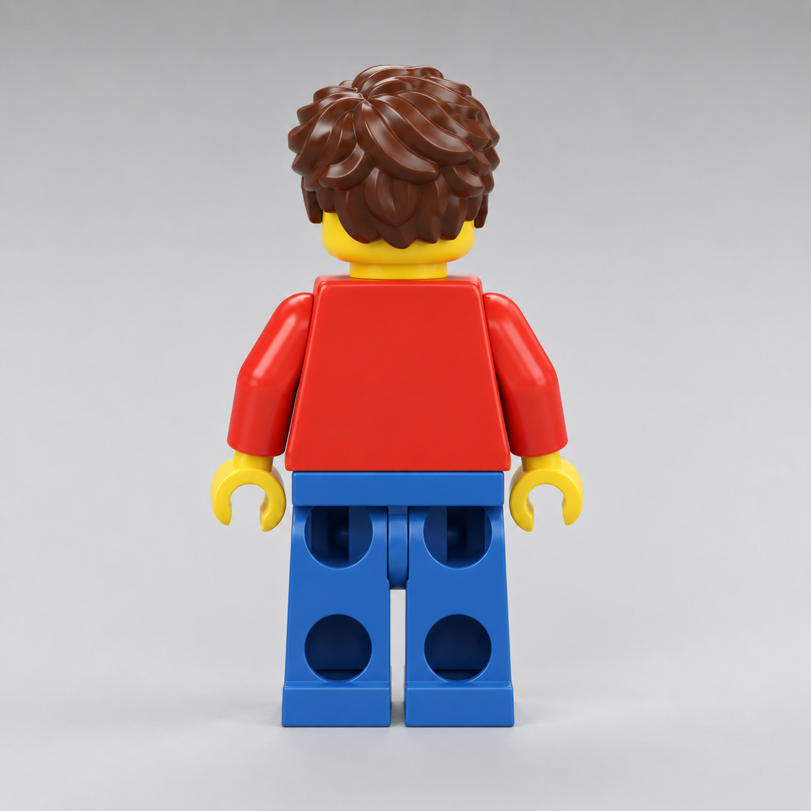

# Owner's rear figurine reference — 2026-09-16

The owner supplied `owner-reference.png` and requested this appearance for the
back of the playable builder. This supplements the
[front reference](../figurine-target/README.md); it does not replace the existing
character, approved arm direction, scale, ground contact or motorcycle controls.

Required rear features:

- Plain red trapezoid torso with rounded molded edges; no backpack or rear print.
- Brown hair with overlapping rounded waves and a layered, scalloped nape.
- Yellow neck and a narrow visible band of yellow head below the rear hair.
- Blue waistband and two separate blue legs, each with an upper and lower
  recessed round socket. These must be actual cavities with interior walls.
- Subtle horizontal rear heel edge, matching the lower foot shape.
- Retain the molded red arms, yellow open grips and existing rigid animation
  hierarchy, walking and seated motorcycle poses.

Use an actual rear render of the exported model for comparison. An image
generation concept is not evidence that the game asset matches. Preserve the
source Blender/GLB files, authoring recipe and hash-bound cooked package.

