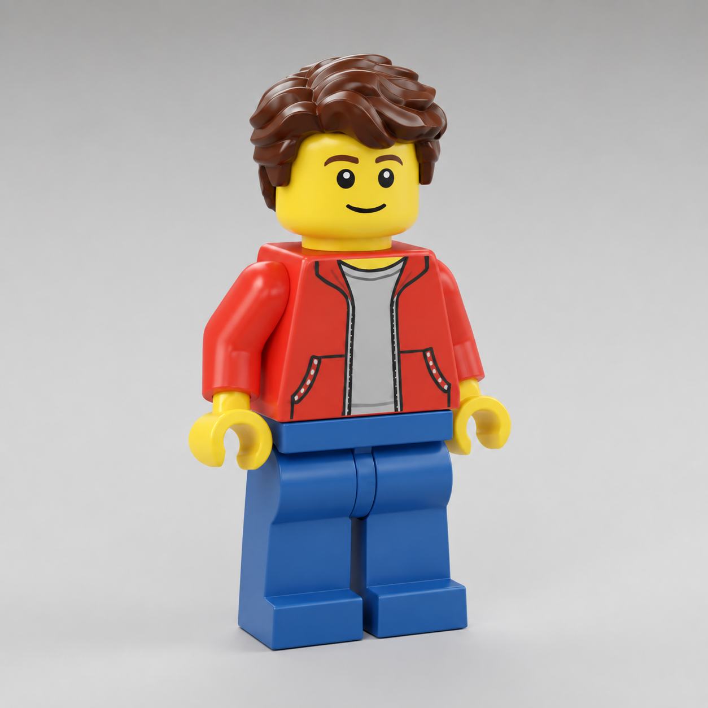

# Definitive owner figurine target — 2026-09-16

This is the latest owner-supplied character target. It supersedes the previous
landscape reference wherever the shape or finish differs. This is a reference,
not a screenshot of an implemented asset and not permission to claim fidelity.
The later [rear-view reference](../figurine-rear-target/README.md) supplements
this front view with layered nape hair and recessed leg sockets.

The figure is a warm, classic construction-toy person: full, swept wavy brown
hair with large overlapping locks; a rounded yellow cylindrical head; friendly
printed eyes with highlights, arched eyebrows and a smile; a glossy red jacket
with clean black zipper/lapel/pocket prints over a grey tee; bent molded sleeves;
short yellow wrists and thick, open C hands; solid blue hinged legs and feet.
The hair must have volume and an irregular silhouette, not fine lines on a bowl.

Maintain the approved 4.76-stud standing height and 1.12-stud controller radius,
foot contact, original warm low sun, scenic start and free-building UI. Retain
the rigid animation ABI and all eight legacy clips. The motorbike seated pose
must continue to fit its saddle and handlebars after character art changes.

Author the actual Blender mesh through `author_human_adventurer.py --builder`
and `builder_reference_shapes.py`. Keep legacy adventure variants unchanged.
Cook all three detail levels, verify their budgets, normals, hand openings,
standing envelope and grounded clips, and check the actual game presentation.
Never substitute an image-generation mockup for verification of the 3D asset.
