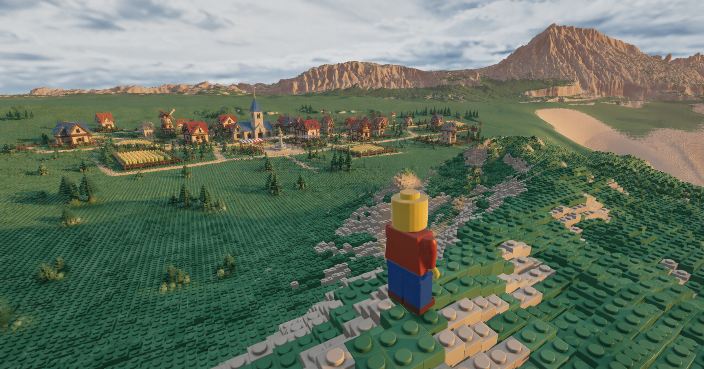

# Creative village target

Owner supplied this reference on 2026-09-16. Use its small, warm LEGO-style
village, cottages, tower, windmill, gardens and connecting paths as direction.
Ignore its old character; retain the current reference minifigure and motorbike.
This is scenery in the free-building world, not a return to the cancelled
adventure campaign. No NPC, quest, combat or economy requirement is implied.

