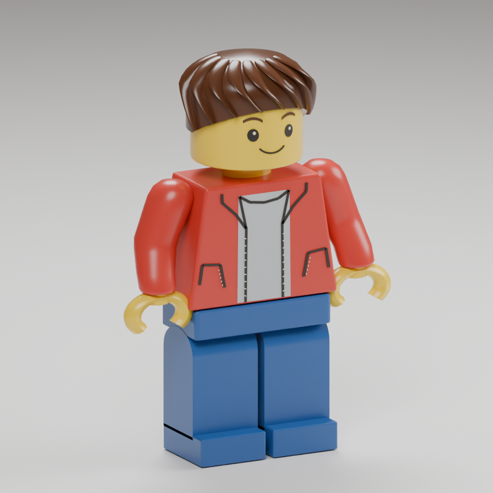

# Builder arm correction — 2026-09-16

The owner rejected the reference-builder arms: the straight sleeve centres
stayed beside the shoulders while the jacket widened below them. This buried
the lower sleeves and wrists in the torso, particularly in the rear game view.

The creative character now has continuous rigid sleeves with rounded shoulder
caps, outward-sloping upper arms and a forward bend into the cuffs. Wrists,
hands and all grip/tool/helm anchors move with that new shape. The existing
shoulder animation, body height, collision, lighting and camera are retained.
Legacy adventure characters are unaffected.

The exported walking envelope is 1.248 authoring units wide (previous limit
1.0). The new 1.27 bound allows the deliberately splayed cosmetic arms; it does
not enlarge the .4-unit controller capsule. The actual game scales both the
model and controller by 2.8. Regression checks require both wrists to be fully
outside the jacket silhouette and still check grounded animation samples.

Reproduce using `tools/adventure_assets/author_human_adventurer.py --builder`,
then `cook_human_adventurer.py` with `bazel-bin/tools/gltf_vmesh_tool`, and
`check_human_adventurer.py`. Each generation/cook requires a new output directory.
The installed package is `data/adventure/builder-r01`; the reference and earlier
evidence remain in [reference-r02](../builder-reference-r02/README.md).

`envelope.json` checks all three actual exported detail levels, all eight clips,
normal lengths, grounded feet and open hand grips. `model.png` is a Blender
render of the actual corrected geometry. It is not a generated concept image.

Local preview: `?experience=build&preview=builder-arms-r03`.
The character and installed-terrain runtime tests pass, as does the browser
build. Installed source hashes and whitespace checks pass. The actual browser
rear view confirms visible sleeves and hands outside the jacket. Animation
coverage above is from exported vertex samples and runtime tests, not a claim
of an exhaustive interactive animation review.
Owner acceptance and publication remain open.

