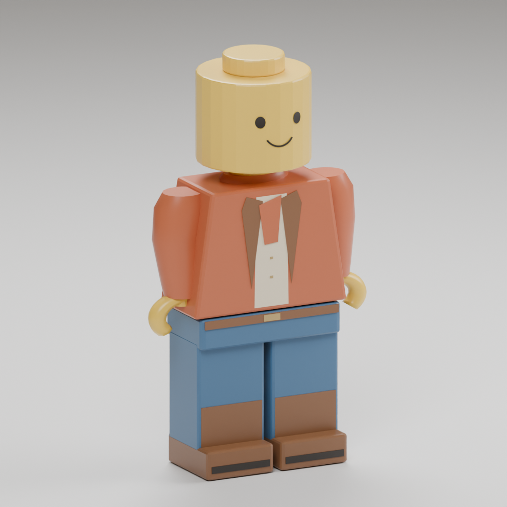

# Creative minifigure revision

The owner rejected the narrow, doll-like adventurer silhouette. The creative
player now uses `data/adventure/builder-r01`, a separately identified original
model. Adventure people, residents and the Cove robot keep their existing assets.

The revised silhouette uses a broad trapezoid torso, stout separated legs,
thicker open C grips and a cylindrical yellow head with an exposed top stud.
The jacket is warm orange-red, the trousers blue; the adventure backpack and
hair cap are omitted. Materials have smoother plastic highlights. The
[official minifigure assembly reference](https://www.lego.com/cdn/product-assets/product.bi.core.pdf/6521814.pdf)
was consulted for visual structure; no third-party mesh or texture was imported.



This image renders the authored bind geometry in Blender, not an image-generation
concept. The final package has the same bind geometry with a corrected idle pose
and walk sole lift. Runtime lighting differs from the studio render.

## Reproduction

Use new output directories, then run:

```sh
/snap/blender/current/blender --background --factory-startup -noaudio --threads 2 \
  --python-exit-code 1 --python tools/adventure_assets/author_human_adventurer.py \
  -- --builder --output-dir /tmp/builder-source
python3 tools/adventure_assets/cook_human_adventurer.py \
  --tool bazel-bin/tools/gltf_vmesh_tool --source-dir /tmp/builder-source \
  --output-dir /tmp/builder-package
python3 tools/adventure_assets/check_human_adventurer.py /tmp/builder-package
```

Use a current cooker built with `bazel build //tools:gltf_vmesh_tool` in the Nix
shell. The older CMake cooker only supports the static rigid profile.
The package retains the bounded 22-node, 15-mesh, eight-clip animation contract.
The internal `robot_*` node names and `human.vmesh` filename are compatibility
labels. Its admitted identity is `voxys-free-build-builder-r01`.

## Verification and limits

`envelope.json` samples all three actual exported levels of detail, including
open hand geometry, normalized normals and grounded walk/land/fall vertices.
The base height remains 1.7 units, scaled to 4.76 studs in creative mode.
The broader core uses base capsule radius 0.4 (1.12 studs in play), with up to
0.02 base units of cosmetic relief at the head stud. Arms and animated strides
remain visual extensions. Placement checks, sweeps and restored-position checks
use the wider body. Foot-contact shading grows to match the new boots.

Existing content/save identities remain stable. Saved builds preserve their
bricks; a saved pose that cannot fit the wider body uses the existing bounded
safe-position recovery. Old prefab doors still require the separately tracked
architectural-kit correction.

Native checks: `//tests:robot_asset`, `//tests:adventure_world`,
`//tests:adventure_construction_policy`, and `//tests:adventure_runtime` with the
installed terrain and workspace opt-in variables. The new model test samples all
eight clips, checks grounded poses and broad head/torso dimensions, and rejects
cross-substitution with the old human identity. Browser build uses
`cmake --build build-lego-wasm --target voxy_wasm -j4` in the Nix shell.

This is a local visual candidate. Publication and owner acceptance remain open.

All listed native checks passed, including the focused creative runtime rerun
after selecting a valid rotated-brick placement for the wider body. The WASM
build and actual in-game visual check passed. Preview:
`http://127.0.0.1:42765/?experience=build&preview=classic-builder`.
