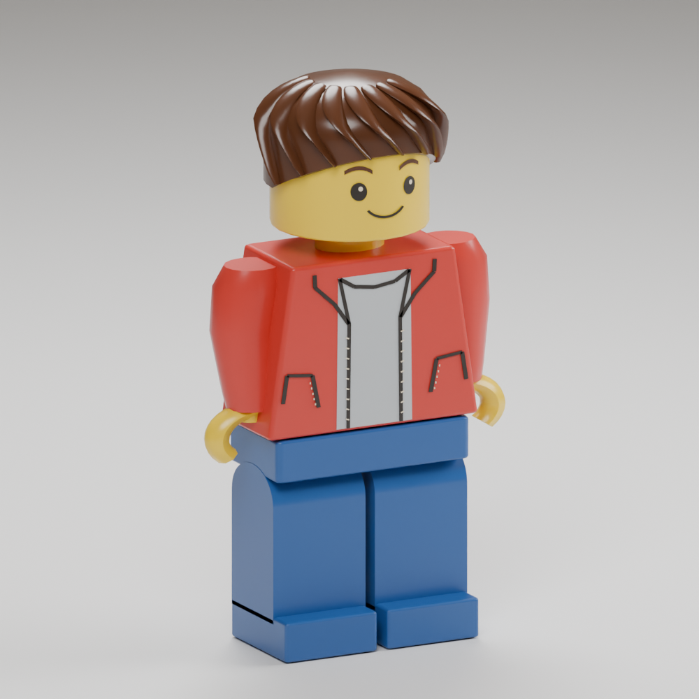

# Builder matched to the owner's reference

The owner supplied [this image](owner-reference.png) and requested this character
direction instead of the exposed-stud prototype. It is the visual brief for the
creative player: swept brown hair, a rounded smiling yellow face with eyebrows
and eye glints, red jacket with printed seams/pockets over a grey tee, solid blue
molded legs and feet, open yellow grips and smooth glossy plastic.

The original 3D geometry is authored in `builder_reference_shapes.py` through the
existing `author_human_adventurer.py --builder` pipeline. Jacket and face details
are thin closed geometry prints. Hair is a continuous cap with raised swept
locks. The rounded upper leg and shaft form one extrusion to avoid coplanar
overlap. The internal shin node remains inside the continuous leg for the rigid
animation contract. No reference pixels are used as runtime textures.

Manufactured surface normals are now enabled for this variant. The final baked
proportion transform applies its inverse transpose to those normals, so rounded
plastic does not regain faceted highlights after resizing. Legacy adventure
characters retain their existing assets and normal treatment.

The first rendered candidate exposed head/hair intersections and overlapping hip
surfaces. The installed candidate uses full hair coverage and a single leg shell.
`model.png` is a render of its actual final Blender source, not a concept image.
The existing 4.76-stud body, 1.12-stud collision radius, animation hierarchy,
boot-contact shading, save identity and scenic opening are retained.

## Reproduction and validation

Run the three generation/cook/check commands in
[the earlier package record](../builder-r01/README.md#reproduction), using new
output directories. The new geometry helper is included in provenance hashes.
`envelope.json` checks actual exported vertices, normals, open grips and sampled
animation clearance for all three detail levels. The 0.4-unit base capsule and
0.02-unit art margin are unchanged.

Native targets: `//tests:robot_asset` and `//tests:adventure_runtime`, with
`VOXY_ADVENTURE_TEST_TERRAIN` set to the installed 8192 raw terrain and
`VOXY_ADVENTURE_TEST_WORKSPACE` set to the repository path. Rebuild the browser
with `cmake --build build-lego-wasm --target voxy_wasm -j4` inside the Nix shell.
The admission tests sample all eight real clips and preserve old package
identity boundaries; runtime checks cover startup, building and exact saves.

Owner visual acceptance and publication remain separate from implementation checks.

All listed native checks passed, as did the final browser build, actual-game
visual check, authoring/package hash verification and whitespace check. Local
preview: `http://127.0.0.1:42765/?experience=build&preview=reference-builder`.

