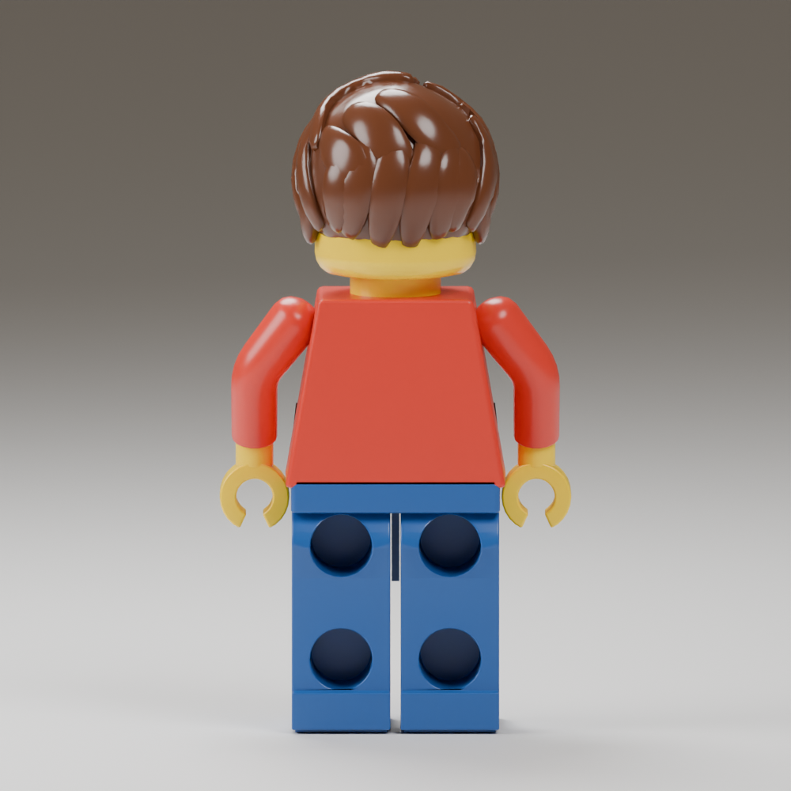
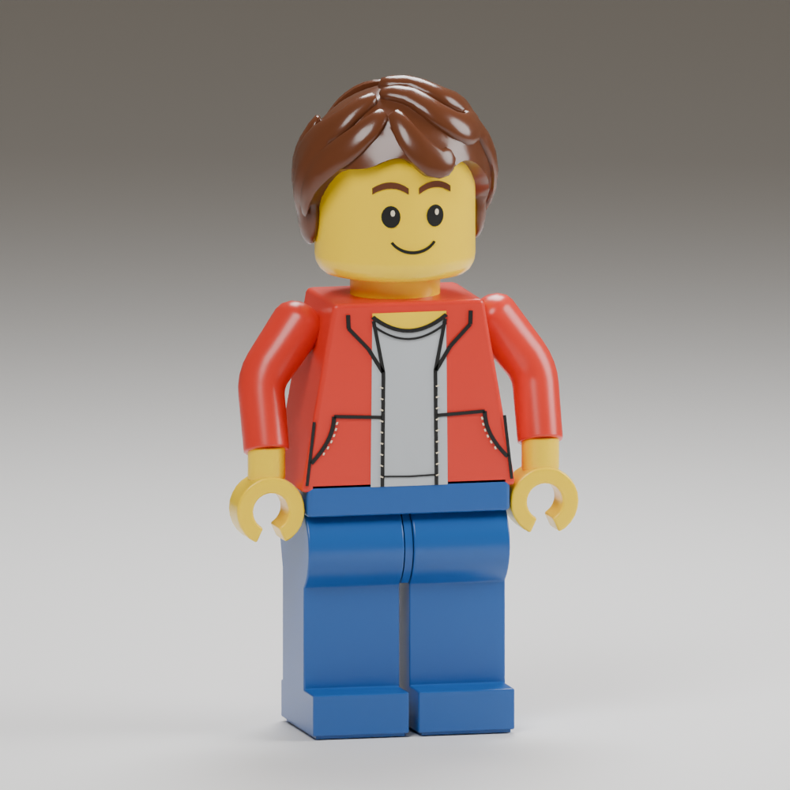

# Rear figurine details — 2026-09-16

Target: [owner's rear reference](../../../design/free-build/figurine-rear-target/README.md).
Installed model: `data/adventure/builder-r01`.

The blue legs now have two blind circular sockets each, with actual interior
walls and floors cut into the mesh. Cutter width compensates for the baked
body proportions, keeping the installed openings round. Authoring ray checks
verify recessed floors at all three detail levels. The hidden shin pivot mesh
was moved into the remaining front wall so it does not fill the lower cavity.
The rear heel has a small molded edge above the foot.

The brown hair has a lower scalloped nape and shorter, overlapping rear layers.
These layers remain closed lobes over the scalp: merging them into the scalp
in the first candidate flattened the boundaries. The plain red back and the
previously revised arm recipe remain unchanged. Front and rear images below
render the actual installed source model, not an image-generation mockup.

Authored vertex/triangle allowances increased to accommodate the real cavities
and hair layers. The cooked GPU cap remains 1 MiB; measured payloads are:

| Detail | Vertices | Triangles | GPU bytes |
| --- | ---: | ---: | ---: |
| Near | 10,268 | 14,386 | 912,376 |
| Middle | 7,162 | 9,038 | 624,568 |
| Far | 4,467 | 5,386 | 386,704 |

The strict cooker, source hashes, normal/hand checks and animation envelope
checks pass. `//tests:robot_asset` and `//tests:adventure_runtime` pass with the
installed 8192 terrain, including motorcycle mounting and dismounting. The WASM
build passes. The core collider, standing height, animation hierarchy, save
format and motorcycle physics are unchanged by this art pass.

Reproduce with the author/cook/check commands in
[the prior record](../figurine-review-r03/README.md), then render with:

```sh
/snap/blender/current/blender --background --factory-startup -noaudio --threads 4 \
  --python-exit-code 1 --python tools/adventure_assets/author_human_proof.py -- \
  --source data/adventure/builder-r01/source/human-lod-0.blend \
  --output /tmp/new-rear-proof.png --rear-view
```

Local preview: `?experience=build&preview=figurine-rear-r05`.
Owner acceptance, full reference fidelity and release remain open. In particular,
the target's irregular hair wave shapes and finish are not an exact match.




