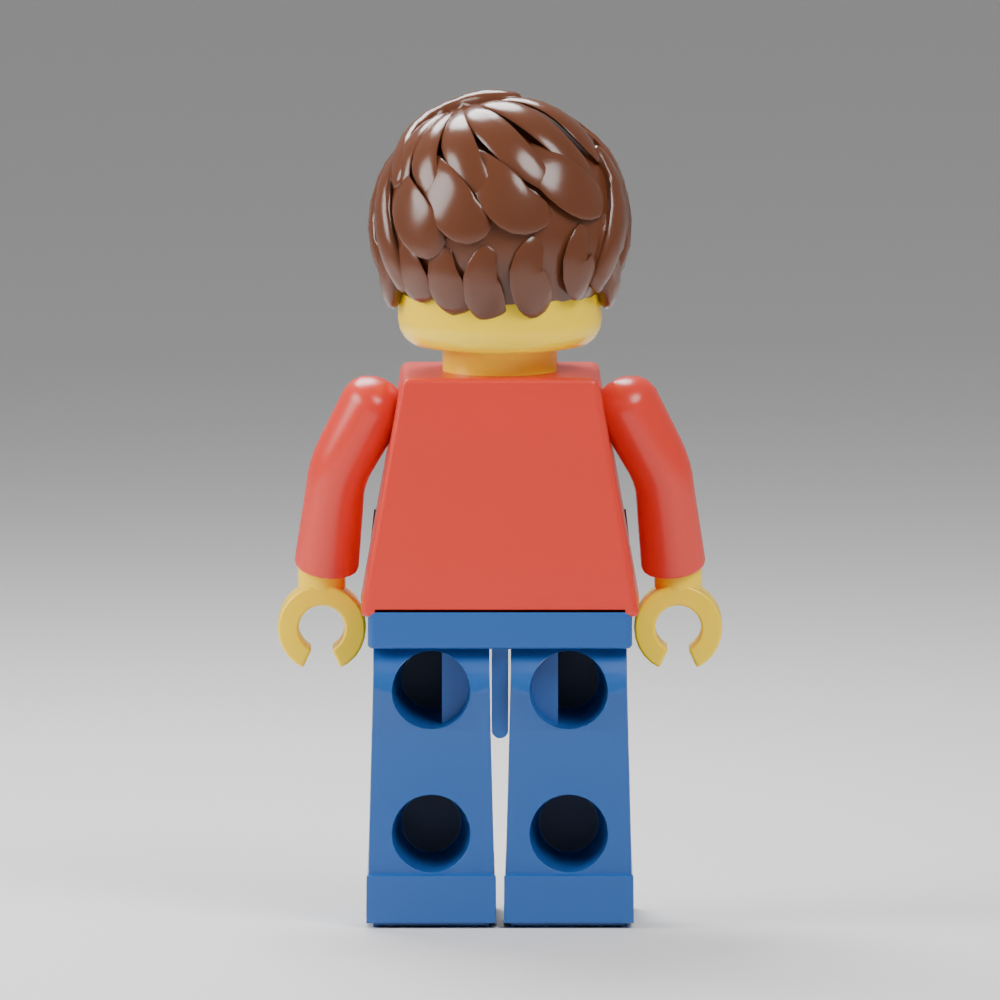
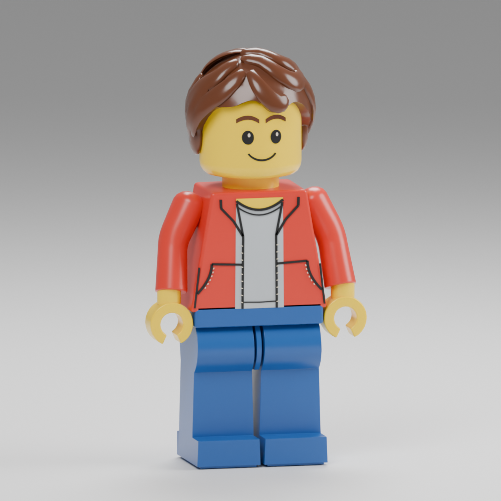

# Independently reviewed rear figurine — 2026-09-16

The owner requested continued correction of the
[rear target](../../../design/free-build/figurine-rear-target/README.md), with a
new agent review. This supersedes the r05 candidate, whose
[review](../figurine-rear-r05/independent-review.md) rejected a close match.

## Implemented changes

- Short nape locks, diagonal middle tiers and six narrow sideways crown locks
  replace the long vertical strips and broad upper pads. Layers sit closer to
  the scalp. The front outline remains intact; height stays 1.7 author units.
- Socket openings retain their size, but the wells taper toward smaller flat
  floors. Mirrored medial ledges give the upper sockets their internal vertical
  divisions. A dark, rough floor material encodes deep-cavity occlusion while
  leaving the opening rims, tapered walls and ledges blue plastic.
- The central connector now has a broader rear face and a semicircular lower
  end. The corrected front hip arc is retained.
- Elbows and cuffs move slightly inward, cuffs cover more of the yellow wrists,
  and forearms are fuller. Hand attachment centres remain unchanged.
- The legs narrow toward their upper ends and widen toward the molded heels.

The runtime controller, standing scale, save format and motorcycle physics are
unchanged. The supported material path uses base color and roughness; it does
not require a new shader or glTF material extension.

## Independent checks

Agent `socket_shading_check` inspected the installed Blender floor faces and
custom corner normals. They were correct; the problem was visual depth cues,
not failed Boolean cuts. It recommended tapered wells and medial upper ledges.

Agent `rear_revision_review` inspected the actual revised rear/front renders,
the prior model, an intermediate oblique view and the owner's reference. Its
final verdict for the installed source candidate r11:

> r11 is the strongest candidate. I would accept it for this iteration as a
> stylized approximation.

It found the dominant bulky-hair problem sufficiently addressed, accepted the
connector and heel taper, and found no front-view regression. Remaining polish:
the reference's hair has more curved, flared tips and a scalloped outline;
lower socket floors retain some disk-like ambiguity from directly behind.
An existing dark crown seam remains. Do not claim exact reference fidelity or
owner acceptance from this review.

## Verification and reproduction

Installed package: `data/adventure/builder-r01`, authored from the current
`author_human_adventurer.py --builder` and `builder_reference_shapes.py`.
Source hashes, strict cooking, all three LOD animation/normal/hand/envelope
checks, `//tests:robot_asset` and `//tests:adventure_runtime` pass. Runtime tests
use the installed 8192 terrain and include motorcycle mount/dismount behavior.
The final WASM build passes. Actual browser startup and the updated rear model
were checked in the free-build preview after packaging.

| Detail | Vertices | Triangles | GPU bytes |
| --- | ---: | ---: | ---: |
| Near | 11,760 | 16,166 | 1,041,224 |
| Middle | 8,226 | 10,298 | 716,360 |
| Far | 5,138 | 6,114 | 443,816 |

The hard 1 MiB GPU cap remains unchanged. The near asset has little spare room;
further geometry additions require simplification elsewhere. Authoring limits
were adjusted for the explicit cavities and layers, not the runtime memory cap.

Use the author/cook/check commands in the
[earlier source record](../figurine-review-r03/README.md). Render the actual source
with `author_human_proof.py --rear-view --neutral-studio`; use
`--reference-view --neutral-studio` for the front and `--rear-oblique` to inspect
well depth. The neutral studio options affect proof lighting only.

Local preview: `?experience=build&preview=figurine-rear-reviewed-r06`.

