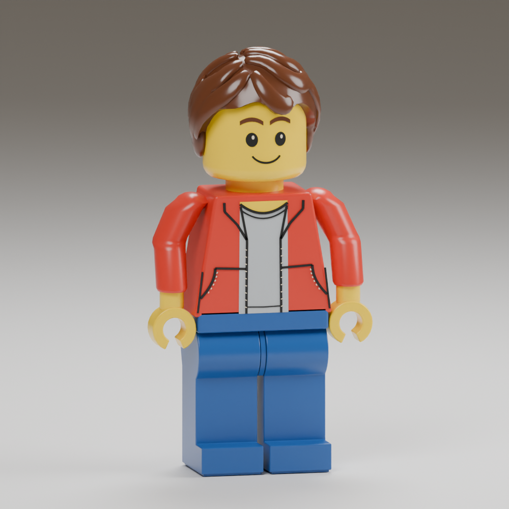

# Figurine comparison and proportion corrections — 2026-09-16

**The reference-matching gate is still open.** The independent visual reviewer
found substantial improvement, but explicitly rejected a claim of full fidelity.
This is a corrected candidate, not owner-approved character art.

Target: [owner reference and brief](../../../design/free-build/figurine-target/README.md).
The owner requested a separate agent comparison after the previous candidate
still felt wrong. [Initial independent findings](../figurine-match-r02/independent-review.md).

## Implemented corrections

- Preserve standing height 1.7 authoring units / 4.76 studs, the existing core
  collider, ground-contact behavior, warm low sun and free-building controls.
- Taller visible face, narrower head/torso/waist/legs, smaller hands and reduced
  arm span. Current independent projected-image measurements put torso width
  near 0.32H versus target 0.31H, head width 0.24H versus 0.24H, and waistband
  width 0.31H versus 0.30H. These are approximate image ratios, not CAD dimensions.
- More tapered jacket, lower shoulder caps, bent sleeves, exposed wrists,
  rounder closer-set eyes, stronger eyebrows and a wider smile. Eye highlights
  have a distinct depth layer to eliminate overlap with the black eye prints.
- Connected curved jacket pocket prints and nested shirt collars beneath a
  yellow neckline crescent.
- Rounded upper leg barrels and a slim curved stationary blue hip connection,
  replacing the open cleft without restoring the oversized center block.
  The sole is inset to remove the visible double outline.
- A closed hair shell with flattened swept locks and sideburns. Close its
  nonplanar hairline through an inner ring inside the head; do not cap it with
  a single large polygon crossing the forehead. Fuse and simplify the hair
  before export; keep outward, face-safe normals at sculpted creases.
- Bike posing reads both hip and shoulder pivots from the actual sampled asset,
  avoiding stale hard-coded pivots when the character's proportions change.

## Independent final verdict — unfinished work

The reviewer compared `model.png` with the owner's reference and reported:

- The main proportion problems are substantially corrected.
- Hair remains the largest gap: this candidate has a neat part and long,
  leaf-shaped locks; the target has broader, irregular overlapping waves and
  more layered volume at the sides.
- Elbow bends still look too sharply jointed.
- Hands still look relatively flat, with angular openings.
- Plastic in the target appears brighter and more saturated, with softer
  highlights. Camera and studio lighting also affect the comparison.

Do not mark reference fidelity, owner visual acceptance, or release complete.
Prioritize the hair's silhouette and overlapping waves, then molded elbow/hand
transitions. Keep the now-correct overall proportions; do not restart broad
scaling based on unmatched perspective views.

## Source, reproduction and checks

Source: `tools/adventure_assets/author_human_adventurer.py --builder` and
`tools/adventure_assets/builder_reference_shapes.py`. Installed package:
`data/adventure/builder-r01`. The helper's flattened locks are joined/remeshed
only during offline authoring; runtime is the existing rigid triangle asset.

Run from the repository root, using fresh output directories:

```sh
/snap/blender/current/blender --background --factory-startup -noaudio --threads 2 --python-exit-code 1 --python tools/adventure_assets/author_human_adventurer.py -- --builder --output-dir /tmp/new-figurine-source
python3 tools/adventure_assets/cook_human_adventurer.py --tool bazel-bin/tools/gltf_vmesh_tool --source-dir /tmp/new-figurine-source --output-dir /tmp/new-figurine-cooked
python3 tools/adventure_assets/check_human_adventurer.py /tmp/new-figurine-cooked
/snap/blender/current/blender --background --factory-startup -noaudio --threads 4 --python-exit-code 1 --python tools/adventure_assets/author_human_proof.py -- --source /tmp/new-figurine-source/source/human-lod-0.blend --output /tmp/new-figurine-proof.png --reference-view
```

`model.png` renders the actual installed source geometry. The reference-view
option uses a near-frontal camera; lighting, AgX and the authored materials are
unchanged from the prior proof recipe. It is not an image-generation mockup or
an in-game screenshot. `envelope.json` checks all three exported detail levels,
open grips, normal lengths and sampled animation/ground-contact envelopes.

All export checks pass. `//tests:robot_asset`, `//tests:adventure_runtime` with the
installed 8192 terrain, and `//tests:adventure_world` pass. WASM builds successfully.
The updated proportion assertions replace the superseded broad-body target;
height, grounded clips, identity admission and memory budgets remain checked.
Actual browser startup, M mounting, revised seated pose and M dismounting also
pass at `?experience=build&preview=figurine-reviewed-r03`. The game preview is
local; this pass has not been published.


