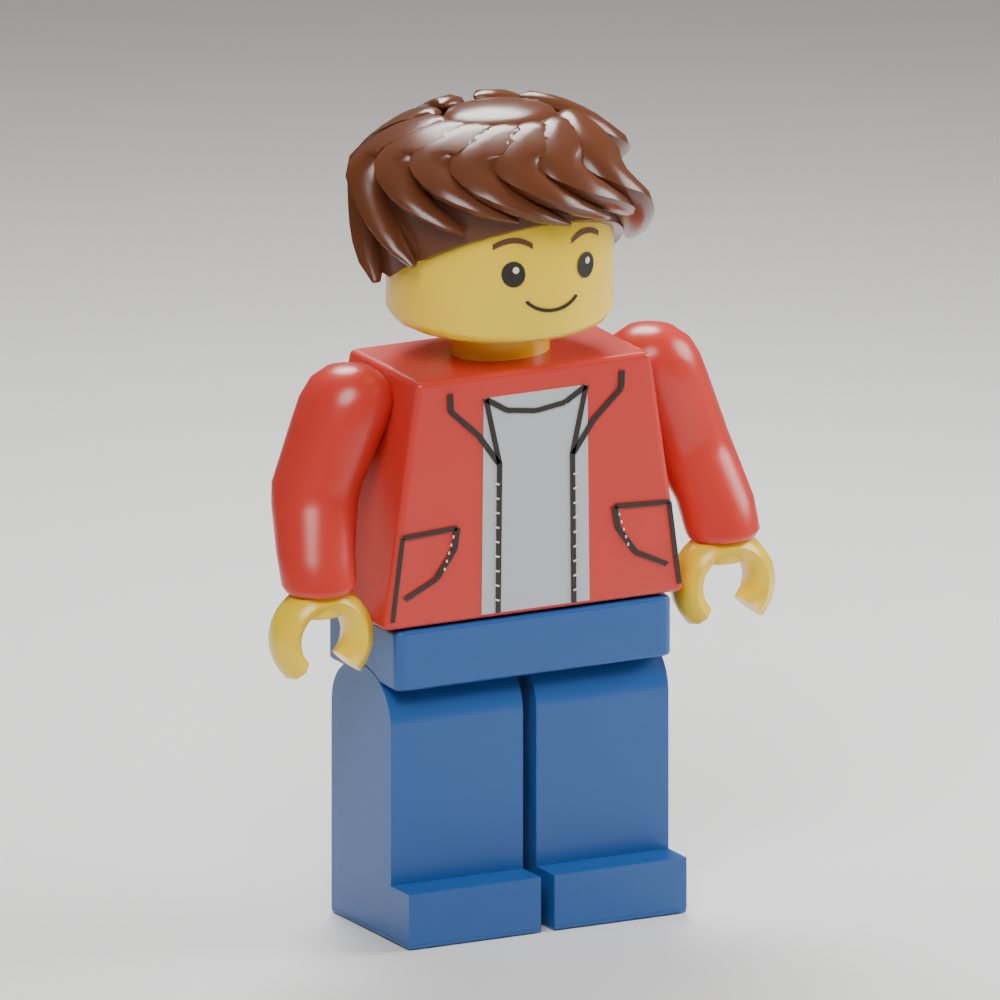

# Figurine target pass — 2026-09-16

The [definitive owner reference](../../../design/free-build/figurine-target/README.md)
is the visual target, not a claim of pixel-exact equivalence or owner acceptance.

This pass replaces the thin comb-like hair ridges with broad swept locks and a
rounded crown, rounds the yellow head's top/bottom edges, and makes the C hands
thicker and circular after the body-width transform. The jacket has cleaner
curved pocket prints. The leg and toe now share one continuous visible extrusion;
a thin sole retains the real foot node/contact bounds without an overlapping
foot box. All eight clips and the existing rigid hierarchy remain intact.

The standing height remains 1.7 authoring units / 4.76 studs. The original .4-unit
core capsule, scaled by 2.8 in free build, remains unchanged. Hair is fitted to
the existing .02-unit art relief allowance. Hands keep the same grip centres,
so the motorbike's saddle and straight handlebar alignment remain valid.

Source: `tools/adventure_assets/author_human_adventurer.py --builder` and
`builder_reference_shapes.py`; installed package: `data/adventure/builder-r01`.
Reproduce with the existing author/cook/check pipeline using fresh directories.
`model.png` is a render of actual source geometry; `envelope.json` checks actual
exported vertices across all three detail levels and eight sampled clips.

Verification: character admission and grounded clips (`//tests:robot_asset`),
creative/legacy runtime with the installed 8192 terrain (`//tests:adventure_runtime`),
motorbike controls/collision (`//tests:adventure_world`), browser build and actual
mounted/unmounted review. UI checks cover M-button routing and riding controls.
All listed checks passed. Final browser M mounting and dismounting passed with
the revised figure. Local preview: `?experience=build&preview=figurine-target-r01`.
These checks do not replace owner visual approval of the target likeness.

