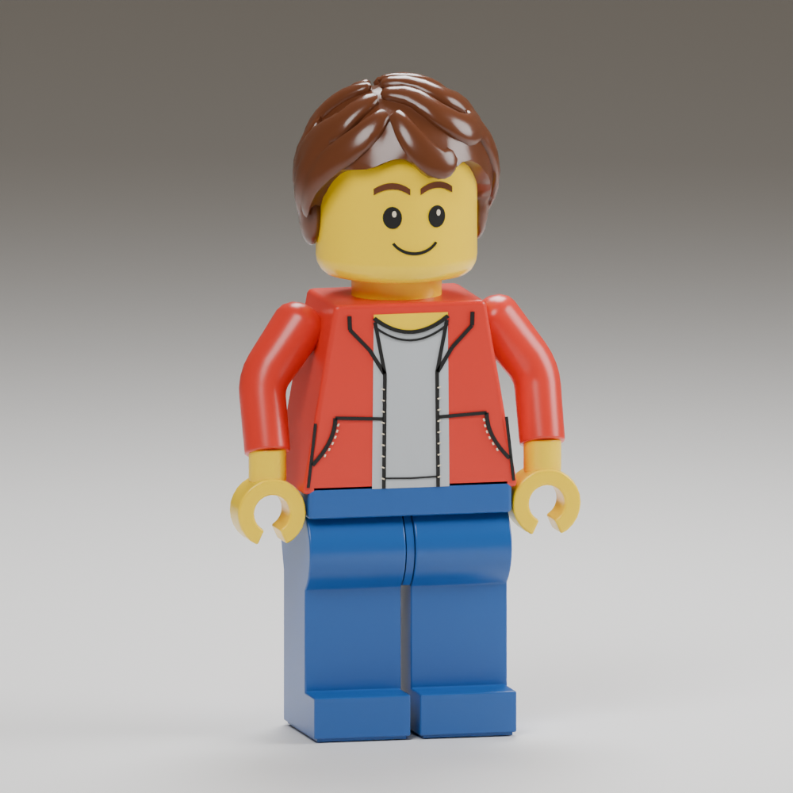

# Continuous molded arms — 2026-09-16

The owner rejected the sharply bent sleeves in the previous figurine candidate.
The [owner's close-up reference](../../../design/free-build/figurine-target/README.md)
remains authoritative. This pass changes the arm mesh in the actual installed
builder; it does not claim completion of the broader hair/material likeness gate.

The old sleeve used horizontal elliptical slices, even around its sloping upper
arm and elbow. That produced a miter-like corner, pinched highlights and a
swollen shoulder outline. `builder_reference_shapes.py::sleeve` now sweeps
elliptical sections perpendicular to a continuous centerline. A tangent-matched
quadratic fillet rounds the elbow, a compact domed cap seats the shoulder, and
three small rim sections round into a definite flat cuff.

The geometry is authored in final body dimensions before undoing the existing
baked X/Z proportions. It remains a single rigid molded sleeve: there is no new
elbow joint, separate cylinder, skinning or deformation system. Wrist/hand/grip
centres and the animation hierarchy remain unchanged. All three detail levels
fit the existing budgets (8,396 / 5,906 / 3,631 vertices and 10,937 / 7,021 / 4,101
triangles for the whole character).

Installed package: `data/adventure/builder-r01`. Author, cook, envelope-check and
render using the commands in the [previous validation record](../figurine-review-r03/README.md).
`model.png` is the actual source mesh rendered with `--reference-view`, using the
same camera, material and studio-light settings as the previous comparison.
`envelope.json` checks exported vertices, open grips, normals and all sampled
clips across three detail levels.

Export checks, installed authoring-source hashes, `//tests:robot_asset` and
`//tests:adventure_runtime` on the installed 8192 terrain pass. The WASM build
passes. Local preview: `?experience=build&preview=molded-arms-r04`.
Publication and owner visual acceptance remain separate.

