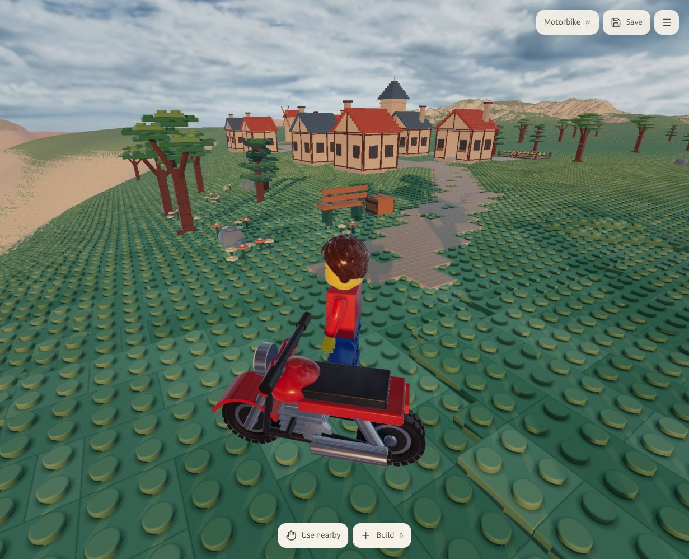

# Small creative village — implementation and verification

**Visual target not met.** The owner rejected the reference gap on 2026-09-17.
The checks below establish functional first-pass behavior, not visual acceptance.
See [the corrective review](../../../design/free-build/village/reference-gap-review.md).

## What is installed

Eight walkable timber cottages, one tower, one windmill, four fenced crop
beds, a roofed well and a connected paving network on the inland shelf near
the bay starting overlook. Center roughly X1110 / Z-1065; the starting point
remains X1200 / Z-1120. Turn right from the initial bay view and follow the
light stone path inland. Existing current figurine and bike remain unchanged.

The owner reference is retained in ../../../design/free-build/village/.
Cottages use red/slate stepped roofs, molded studs, cream walls, framed
windows on front/rear/sides, exposed timber and flower boxes. Materials have
.68 roughness. The light and time of day are unchanged.

## Implementation

- `author_creative_village.py` builds eight original reusable mesh variants
  in Blender. `cook_creative_village.py` verifies topology, normals, bounds,
  identity roots and budgets and generates the matching collision header.
- Installed package: `data/adventure/creative-village-r01`. Editable Blend/GLB,
  provenance and manifest are included. Runtime verifies exact size/SHA-256.
- 56,987 vertices, 76,868 triangles across the whole shared kit, 32 material
  draws, 8 materials, 4,566,781 cooked bytes. This is kit cost, not whole-scene
  cost. Buildings reuse the kit; draw distance is 420 studs. No village LOD yet.
- Foundations extend to terrain; entry steps use .28-stud rises. Cottage
  doorways have 3.3-stud width and 5.6-stud clear height for the 4.76-stud figure.
  Interior collision consists of actual walls, floor and roof, not a solid box.
- Whole groups yield to player builds and door reservations, including their
  roof/step/foundation bounds. No orphan scenery remains. They stay suppressed
  for that session; saved builds are rechecked on load. Scenery cannot be
  collected or edited as inventory bricks. New groups defer to player/bike.
- Trees are excluded from village envelopes, including roofs and mill sails.
  Owned construction takes priority within the existing solid/draw limits.

## Verification and critique

30 world tests, 15 door tests and 2 runtime integration tests pass on the real
8192² heightfield. The independent agent wrote and ran the village tests:
all buildings admitted; full-size figure walks from spawn along the approach
and enters/exits every cottage; bike traverses the lane beside the well without
snagging; owned construction removes a complete cottage and keeps its neighbour.
The strict cooker verifies 4,988 flat horizontal triangles with exact cap normals.

Independent review caught low cottage trim across open doors and tower belts
filling the entrance/interior. Both were fixed before browser verification.
The first in-game review caught blank cottage sides/backs and plain roof surfaces.
Rear/side windows, timber framing, roof studs and warmer paving address those.
The initial agent review reported no visible blockers at the overview scale.
That assessment used too low a visual bar. Cottage silhouette variation, readable
landmarks, settlement composition and richer gardens remain substantial work
needed to meet the reference, not merely optional polish.
Paving was then split into independently grounded 1x1 tiles to close skipped
terrace patches; all movement and integration tests pass again.

## Scope still open

Owner visual/play acceptance and measured frame-time budgets remain open.
No NPCs, furnished homes, animated mill, harvest system, building ownership or
quest logic. Forest repetition and distance transition polish are separate work.
This is a playable scenery addition, not completion of the wider F1/F2 gates.

Final paving code was reviewed independently: no new blocker. Browser build
and fresh-page rendering pass. The preview remains open at
`http://127.0.0.1:42765/?experience=build&preview=village-r04&telemetry=0`.
