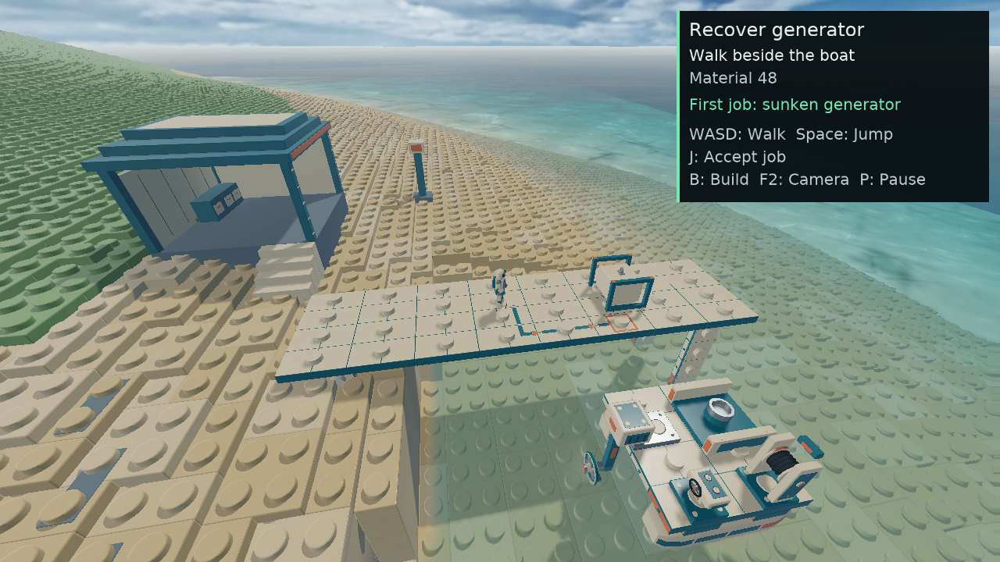

# Playable Cove visual finish

Implemented and checked in the playable Cove, 2026-09-12, against the published
robot/camera baseline `49e11b45d5df545779e464fbff53de44fd4b45ad`. This completes
the bounded Cove art/material/effects components requested under D48.
The early visual composition has independent agent acceptance; the owner has
not yet reviewed this revision. Full production task prerequisites remain in
[the implementation plan](../../../../../GAME_IMPLEMENTATION_TODO.md).

[Actual browser arrival, decoded from its recording](images/browser-canvas-first.png)
· [12-second browser gameplay recording](media/playable-motion.webm)
· [Independent visual review](visual-review.md)

The vessel is physically floating and responds to normal controls. These are
actual game outputs, not Blender renders or generated concepts.

## Direction

A coastal workshop built from recognizable toy parts: warm cream plastic,
teal panels and water, coral safety accents, slate shore masonry, restrained
steel and rubber. Studs, plate steps, exposed connections and the existing
modular skiff remain central. The final weather is a clear coastal afternoon
with a warm directional sun and cool sky fill. No new weather simulation is
implied.

The workshop and its four steps provide a walkable foreground destination.
A broken hull and two navigation beacons organize the middle distance;
the existing stepped island supplies the horizon. The powered harbor gantry
uses an authored beveled model only after the real installation is durable.
Its ten physical boxes and lifting opening are unchanged.

## Runtime contract

- `data/salvage/cove-environment-r01` is original Blender-authored art, with
  three scenery and three gantry LODs. The package includes source files,
  strict cooks, exact hashes, provenance and geometry reports. No third-party
  artwork or generated textures are used.
- All six LOD payloads request **1,241,888 GPU bytes**. Admission reconstructs
  prefabs and checks envelopes and counts; it does not trust cached totals
  in a caller-constructed asset. The fixed package ceiling is 2 MiB.
- Thirty-nine scene-local lattice boxes produce a static authored physics
  shape and the same player/camera obstacles. Environment collision is kept
  across harbor installation, rebuilt boats and save restoration. It has no
  construction identity, inventory entry, price or salvage reward.
- Existing berth, cargo, delivery and dock geometry remain unchanged.
  Environment origin is the existing Cove origin `(-19,-200,-37)` metres.
- A separate four-float surface field carries accepted wet coverage, saved
  normalized damage, explicit Cove response enable, and current immersion.
  Paint, body identity and alpha are unchanged. Legacy all-zero surfaces
  retain their original response. Wetness uses a bounded cosmetic wave
  approximation and eight-second drying; physical forces use the GPU water.
- Film reflections preserve conductor color and attenuate substrate energy.
  Immersion suppresses the extra air/water coat below the ocean surface;
  submerged plastic retains its water/plastic substrate reflection.
  Roughness accounts for normal variance. Saved condition changes surface
  roughness; this does not invent gameplay damage or arbitrary fracture art.
  Weld-separated parts retain their existing closed authored surfaces.
- Terrain and meshes sample the current fixture generation's filtered
  environment. The terrain pass stays within WebGPU's baseline sixteen
  sampled textures. Cove retains ACES exposure and sRGB output, with the
  previous grain/vignette removed. Water uses greater red than blue/green
  absorption for readable turquoise depth; wave forces are unchanged.
- Kit LOD projection follows accepted moving roots and the raised workbench.
  Environment LOD thresholds are 320/110 projected vertical pixels.
- Cables use lit eight-sided round tubes with the existing 28 mm diameter
  and actual endpoints. They do not invent cable sag or tension.
- A fixed 512-slot pool supplies wakes, propeller foam, splash, surface runoff
  and impact dust. Sources and contacts must join completed poses with exact
  body generations. Pause freezes effects; discontinuities clear stale state.
  These effects never change cargo, ownership, save data or forces.
- The effect draw requests **33,328 GPU bytes**, uses the live GPU water
  displacement and final radial depth, and never writes depth. It is a
  premultiplied overlay after tone mapping. It is not HDR temporal
  reconstruction or refracted airborne effects through water.
- Effects are allocated once by the Cove owner. Each active/candidate/retiring
  fixture conservatively reserves that dependency inside its unchanged
  16 MiB ceiling; aggregate fixture reservations remain capped at 48 MiB.
  Submitted resources retire only through the existing frame tickets.

## Verified results

- [x] Final native CMake application build r08 and browser/WASM build r06.
  Both include the new cooked environment. [Final source identities](checks/source-hashes.json)
  and [built executable/package identities](checks/build-hashes.json) bind the inputs.
  Exact frozen web files are listed
  in [the package hashes](checks/web-r02-hashes.json); build logs and corrected
  failures are retained under [checks/builds](checks/builds/).
- [x] Strict original asset cooks, environment admission/collision/sector
  checks and independent source review. See [environment.md](environment.md).
- [x] Native actual controls: old-save restore, dock approach, four workshop
  steps, wall/camera collision, workshop access and durable save. The route
  passed six stages, then its unnecessary restore-focus assertion failed.
  A short read-only continuation from that exact durable save passed the
  final restore proof. This is combined evidence, not a clean seven-stage
  original driver. The preserved record also explains the earlier real
  stair bug and its fix. All 11 starter part records, connections and stock
  remain unchanged. The saved workshop position and camera preferences restore
  correctly, and the original source slot stays untouched. This source world
  has no paid extra parts; this route does not claim a paid-parts save test.
- [x] Browser actual controls passed all eight effects stages in **8.630s**:
  walking/boarding, horizontal sailing, wake/foam, pause freeze, player water
  entry, rescue clearing and exact design/ownership preservation. The final
  process exited 0 with no browser or WebGPU runtime errors. The first
  attempt's premature distance assertion and driver correction remain in
  [effects.md](effects.md). Numerical renderer checks prove depth/displacement;
  gameplay counters alone are not treated as pixel proof.
- [x] Wet/immersed plastic, retained metal identity, roughness/damage input,
  live-root LOD, shared filtered lighting, round ropes and underwater shadow
  energy pass focused renderer/owner checks. The 64-brick capacity case
  passes with unchanged ceilings. See [materials.md](materials.md).
- [x] Receiver-plane shadow correction removes the visible diagonal stipple
  without increasing global bias or erasing nearby casters. The independent
  raster test checks 256 clear phases and 64 samples under a 6 cm caster.
  Legacy and Cove moving-shadow/composition cases pass. See
  [shadows.md](shadows.md).
- [x] Compact browser controls pass 38 preview assertion groups and 29
  controller cases. At 1280×720 the real panel is352 × 346.07 px at(904,24),
  with no initial vertical overflow. More controls preserves keyboard and
  controller access; actual F2 and winch disclosure behavior has source review.
  Native walking/sailing information occupies400 × 245 px at(866,14).
- [x] Final native/browser scene composition and sampled moving views have
  [independent review](visual-review.md). Retained findings include the small
  robot at this wide view, regular terrain repetition and sparse horizon.
- [x] Mandatory whole-project suite: **2,207 game passes**, three skips,
  four disabled, zero failures; terrain import ten passes and one skip.
  The game suite ran all 2,210 enabled cases in 1,113.471s; terrain import
  reused its valid cached pass. [Summary and exact command](checks/mandatory-summary.json),
  [game XML](checks/mandatory-game.xml), [terrain XML](checks/mandatory-terrain-import.xml)
  and [outer test log](checks/mandatory-suite-r01.log) retain the result.

This checkpoint uses the normal enabled pre-commit hook and publication to
`main`; do not bypass or weaken the hook. The self-referential commit hash and
remote verification are recorded after publication in the final task response
and local `build-cove-visual-r01/publication.json`. The static preview uses the
same save origin, `http://127.0.0.1:42751/index.html?experience=salvage-cove`,
serving frozen `build-cove-visual-r01/web-r02`. Save an existing session before
reloading; publication does not force a reload of the user's open game.

## Camera, capture and comparison

Both versions use 1280 × 720, vertical FOV 78°, yaw −1.4 rad, elevation 0.60 rad,
distance 12 m, the same shipped Cove configuration and hardware GPU. Startup/reset
changes the arrival framing; existing saved camera settings restore exactly.
The native final observation is at completed tick199 with boat Y −1.53686 m and
speed 0.116275 m/s. The browser recording begins at completed tick185 with
boat Y −1.64625 m and speed 0.69651 m/s. Both boats have completed at least three
simulated seconds; poses are live and not forcibly synchronized. The deck,
workshop, sky and coastline therefore match settings rather than exact wave
phase or pixels. Native runs on AMD Radeon 890M / RADV STRIX1 Vulkan; browser
Chrome 152.0.7977.82 reports hardware AMD RDNA 3, not a fallback adapter.

The first two native stills are retained as rejected inputs: the first caught
the boat before settling with the previous camera; the second exposed a boat
crop and the HUD covering the workshop. The third is the final accepted view.
No unchanged screenshot matrix was run.

The separate browser `Page.captureScreenshot` produced a black game area
behind a valid DOM HUD. That [page PNG](images/rejected-browser-page.png) is
explicitly rejected; its cause is not claimed to be a diagnosed game defect.
The same run's actual canvas recording is valid: 7,292,836 bytes of VP9 at 1280 × 720,
336 decoded frames from a 12-second recording request. Its first decoded frame
is the browser scene still above; it omits the DOM HUD. HUD bounds are supplied
separately by [the observed page state](checks/browser-preflight.json). Four
[decoded movie samples](images/motion-samples.png) support the independent
bounded motion review. No composite image was fabricated and no second game
recording was made. The first driver stopped before its complete effects route;
the later r02 controls pass supplies that proof without extra media.

[Capture provenance](checks/capture-provenance.json),
[native observation](checks/native-observation.json),
[browser capture metadata](checks/browser-capture.json), and
[decoder output](checks/decoded-video.json) retain the exact inputs and limits.
The movie and a startup timing sample are not a frame-time certification.

## Runtime and budget details

The final fixture reserves **11,411,160 bytes**, below the existing 16 MiB per
fixture and 48 MiB aggregate ceilings. The exact fixed mesh/rope storage is
138,616 bytes within its 144 KiB reserve. Environment instances/collision never
become inventory parts. Separate character and effects owners retain the
existing frame-ticket disposal rules. Near/Mid environment pairs submit 24
draws and Far 23; all LOD GPU payload is 1,241,888 bytes. The gantry replaces the
old helper shape only after real installation and uses the same ten physical
boxes/opening. This checkpoint did not capture an actual powered-gantry visit;
its source/geometry/owner implementation is verified separately.

## Reproduction and remaining work

Use the regular Nix shell and project build instructions. Native:
`cmake --build build-native-save-host --target voxy_native -j 4`;
browser: `EM_CONFIG=/tmp/voxys-emsdk/.emscripten cmake --build build-lego-wasm --target voxy_wasm -j 4`.
Those are this workspace's already configured build directories. A fresh
checkout uses the normal README configure steps before those targets.
Run the native application with `--config salvage_cove.cfg --uncapped`, or
serve the built web package and select `?experience=salvage-cove`.
Detailed source/cooker recipes, real-control driver commands, source review and
retained failures are in [environment.md](environment.md),
[materials.md](materials.md), [effects.md](effects.md) and [shadows.md](shadows.md).
Use isolated save storage for automated checks. Preserve users' normal slots.

Required publication checks are
`bazel test //tests:voxy_tests //tools:terrain_diffusion_import_test --test_output=errors`,
plus `node scripts/test_salvage_preview.mjs` and
`node scripts/test_controller_menu.mjs` for the changed web controls.
Do not rerun a passing capture matrix; use a targeted continuation only for a
new change or identified failure.

LOOK-01's composition component is accepted by independent agents. Full
LOOK-01 still requires its ASSET-05/06 prerequisites; VIS-03 still requires
temporal reconstruction, general finished surface/damage states and MECH-05;
VIS-04 still requires full water/event and drain/pump contracts; VIS-05 still
requires full asset review/provenance, second-job progression and final whole
harbor review. Glass, refracted airborne effects, HDR/temporal effects,
arbitrary fracture interiors and production performance are not implemented
by this work. Owner approval remains separate. Continue these explicit plan
items using the completed component evidence rather than rebuilding them.
